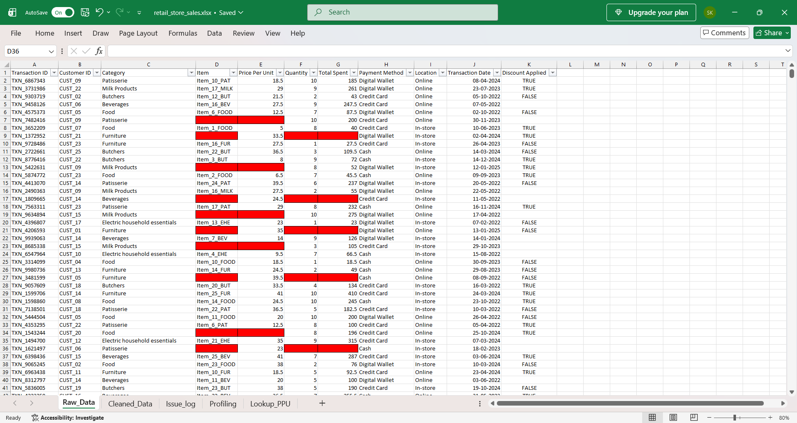
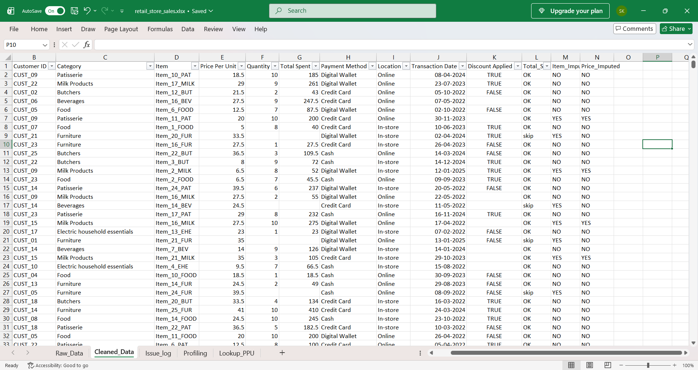
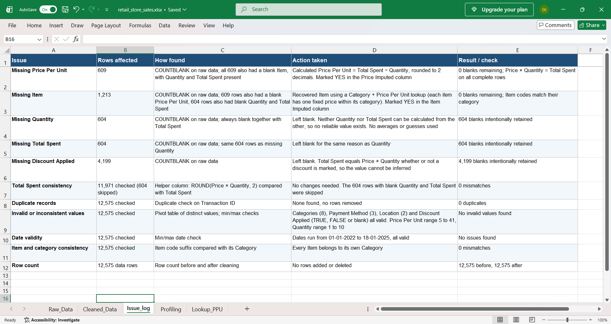

# Retail Store Sales: Data Cleaning & Validation (Excel)

Cleaning a messy 12,575-row retail transactions file in Excel: profiling it, recovering what can be recovered, flagging every change, and leaving the rest blank on purpose.

**Tools:** Microsoft Excel (lookups, formulas, pivot tables, data validation checks)

## The problem

A retail transactions dataset (Jan 2022 to Jan 2025) with 8 product categories, 3 payment methods, and online and in-store sales. It arrived with missing item names, missing prices, and blank quantity, total and discount fields. The goal was to make it analysis-ready **without inventing data**.

## Data source

Dataset: [Retail Store Sales: Dirty for Data Cleaning](https://www.kaggle.com/datasets/ahmedmohamed2003/retail-store-sales-dirty-for-data-cleaning) on Kaggle (published by ahmedmohamed2003). The original CSV is included in `data/` for reference, and the `Raw_Data` sheet in the workbook is that file, unedited. Please check the license on the Kaggle page before reusing the data.

## Results

| Column | Blank before | Blank after | What I did |
|---|---:|---:|---|
| Item | 1,213 | **0** | Recovered with a Category + Price Per Unit lookup |
| Price Per Unit | 609 | **0** | Calculated as Total Spent ÷ Quantity |
| Quantity | 604 | 604 | Left blank (cannot be recovered) |
| Total Spent | 604 | 604 | Left blank (cannot be recovered) |
| Discount Applied | 4,199 | 4,199 | Left blank (cannot be inferred) |

**Validation results**
- 12,575 rows before and after, none added or deleted
- **0** duplicate Transaction IDs
- **0** rows where Price × Quantity ≠ Total Spent (11,971 complete rows checked; 604 skipped because Quantity and Total Spent are blank)
- Every Item belongs to its own Category (0 mismatches)
- All dates valid (01-01-2022 to 18-01-2025)

## What I found in the data

Profiling showed the blanks follow two clean patterns, which is what made safe fixes possible:

| Group | Rows | Blank | Present | Recoverable? |
|---|---:|---|---|---|
| A | 609 | Item, Price Per Unit | Quantity, Total Spent, Category | Yes. Price = Total ÷ Quantity, then Item from lookup |
| B | 604 | Item, Quantity, Total Spent | Price Per Unit, Category | Item only. Quantity and Total Spent each need the other |

Each item has exactly one fixed price within its category, so a Category + Price lookup identifies the Item with no guessing.

## Method

1. **Keep the raw data untouched.** `Raw_Data` is never edited, so every change can be traced.
2. **Profile first.** Blank counts per column, distinct values, min/max checks, duplicate check. (Sheet: `Profiling`)
3. **Flag before filling.** `Item_Imputed` and `Price_Imputed` columns record which rows were blank in the original, so a reader can always tell original values from recovered ones. 1,213 and 609 rows are flagged.
4. **Fill in the right order.** Price Per Unit first (rounded to 2 decimals so lookups match exactly), then Item, because the Item lookup depends on price.
5. **Validate.** A `Total_Spent_validation` column checks Price × Quantity = Total Spent on every complete row.
6. **Document.** Every issue, row count, action and check is written up in `Issue_log`.

### Why leave values blank?

Filling the 604 missing quantities with an average would make the file look complete but quietly distort revenue and totals. A documented gap is better than an invented number.

## Workbook guide

| Sheet | Contents |
|---|---|
| `Raw_Data` | Original data, unchanged |
| `Cleaned_Data` | Cleaned data with `Total_Spent_validation`, `Item_Imputed`, `Price_Imputed` |
| `Issue_log` | Every issue with rows affected, how found, action taken and check result |
| `Profiling` | Distinct values, min/max, row counts, blank counts, duplicate check |
| `Lookup_PPU` | Category, Item and Price reference table used to recover Items |

## Screenshots

**Raw data (note the blank Item, Price Per Unit, Quantity and Total Spent cells):**



**Cleaned data (recovered values and imputed flags):**



**Issue log:**



## Skills demonstrated

Data profiling · missing-data analysis · lookup-based imputation · pivot tables · validation checks · audit trail and documentation

## Repo structure

```
retail-store-sales-data-cleaning/
├── data/
│   ├── retail_store_sales.csv      # original dataset from Kaggle
│   └── retail_store_sales.xlsx     # cleaned workbook
├── images/
│   ├── raw_data.png
│   ├── cleaned_data.png
│   └── issue-log.png
└── README.md
```

## Author

Sonu Kumar · [GitHub](https://github.com/KumarSonuu) · [LinkedIn](https://linkedin.com/in/sonu-kumar-dev1)
